## NTFS really isn't that bad

Slides at https://github.com/rbtcollins/reveal.js

<small>Robert Collins ; He/him

robertc@robertcollins.net

@rbtcollins (Twitter)

Currently available for hire(come see me |
https://www.linkedin.com/in/rbtcollins/)

Rustup working group member
</small>
Note:
Thank you for coming to listen to my tale today. I hope you will enjoy it. We're going to talk about a 10x performance improvement in rustup on Windows, well, mostly on Windows.


## Protocol - Questions

* *Questions* at anytime are fine.
* The most important questions are those where you didn't follow what I said.
* During the talk just raise a hand to get my attention.
* If you can't do that, please ask the Session Chair to facilitate.
* **Don't** wait for the mic to be brought to you: *I* will repeat questions
  to keep things moving quickly.
* But if I ask you to wait or see me later, please respect everyones time and
  do so.

Note:
I don't want to leave anyone behind


## Protocol - Discussions

* Please save less important questions and *discussions* for the end.
* Discussions are anything where you disagree with conclusions I'm drawing,
  methodologies I'm using, think there is a better way to have done it, etc.

Note: 
* I value the feedback, just not in this context where a lot of people
all have process it. 
* Come see me after the talk.


On a road trip, far from my chunky workstation

Note:
I was using my Surface, horrid motel Wifi, worse 4G. Rust-lang installed very very slowly. What was up with that?


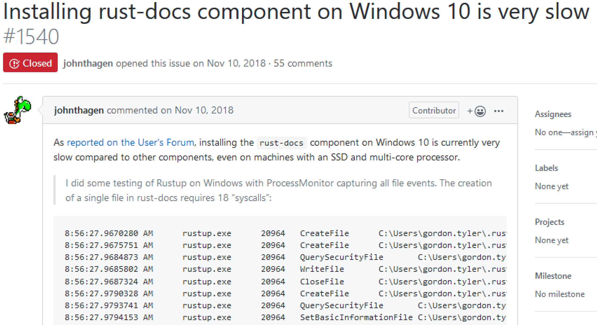
Note:
Ah good, there's a bug report


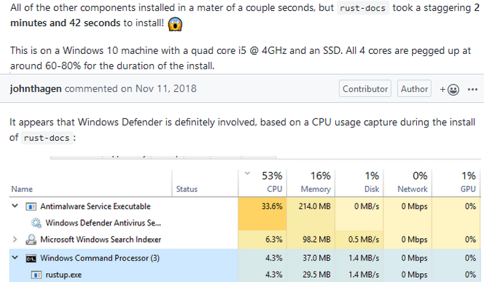
Note:
Correctly blaming anti-virus! Problem Solved! Why is the bug still open?


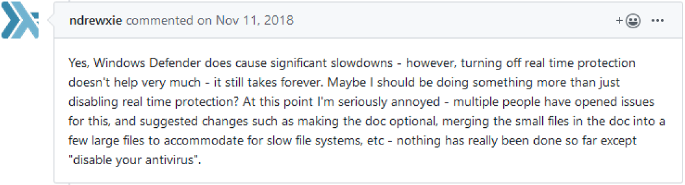
Note:
Oh. Its still slow even if you turn off Defender :(.


..techsplaining mostly elided..
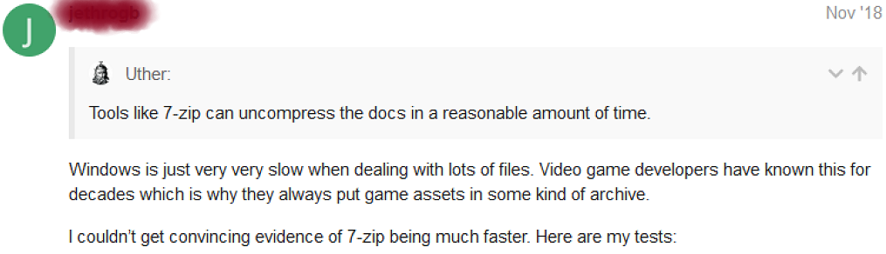


What is common between these things?
```
    rustup (Windows) 3m43s
    7-zip (Windows) 2m35s
    FastCopy (Windows) 2m53s
    tar (Linux) <1.5s
```
Note:
None of them are able to make NTFS perform well. Or, for that matter, NFS,
GlusterFS, CephFS and a whole range of other file systems. Ext4 on an SSD, great.


The bug had gone off the rails. And initially, I helped.
* "NTFS is bad and can't be fixed"
* Lets not ship docs (but users want them on flights)
* Lets ship them in a zip or .ISO
* Lets only unpack them when the user asks for it


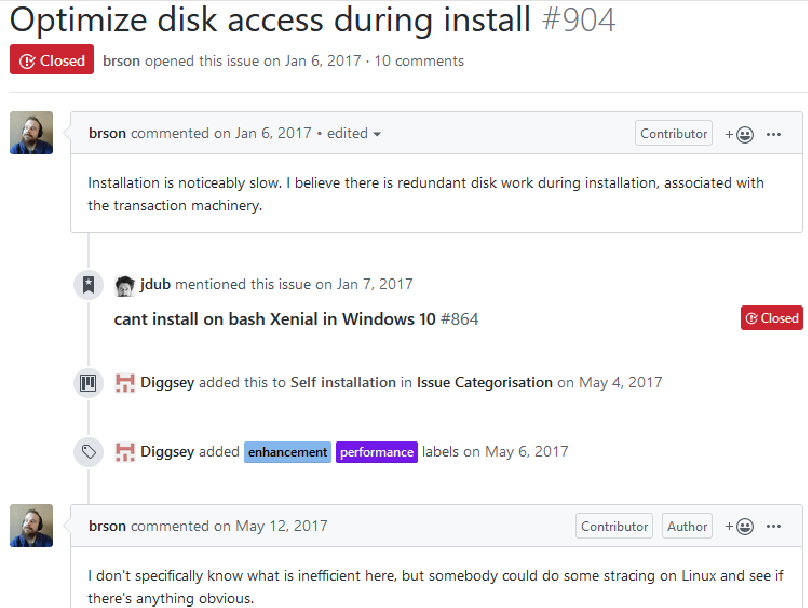
Note: Fortunately, I ran across this broader bug for all file systems.


Around about here I submitted my first patch - lets call this v1
```
Date:   Tue Apr 9 12:53:15 2019 +1200

    Less copying during dist installation

    Per #904 copying the contents of dists out of the extracted staging
    directory and then later deleting that same staging directory consumes
    60s out of a total of 200s on Windows.

    Wall clock testing shows this patch reduces
    `rustup toolchain install nightly` from 3m45 to 2m23 for me - including
    download times etc.

    I'm sure there is more that can be done, thus I'm not marking this as
    a closing merge for #904.
```
Note: 1 minute on the total runtime isn't too bad.


 
Note: The rust project I had been working on is long forgotten at this point.
I'm just sitting there installing and uninstalling rust, looking at process monitor
(a sysinternals tool, now from Microsoft - think a GUI strace) traces.
rustup isn't super easy to do perf work on. The different stages it goes through
are not well isolated, and I was doing hacky things to avoid downloading rust
each time from the internet (copying files while they were in use and arrgh).


v2: terminfo

Note: My v2 patch fixed a bug where terminfo was opened way too many times.
Global state needs to be managed as global state. rustup isn't /good rust/ in
this regard - not a reflection on rust. 


v3: parent dir stat caching: 1-2 seconds

Note: My v3 patch improved tar unpacking so that the parent directory of a path was
only statted once per directory name, rather than once per child of that
directory. This saved 20k stats.


v4: larger untar read buffer: 0-12 seconds
```
    Buffer reads from package tarfiles

    This has variable impact on extract - when plenty of buffer cache is
    available no impact; but in low-cache situations this avoids contention
    as rust-docs writes several hundred MB but needs read only 11MB of
    archive. I've measured this at between 0 seconds and 12 seconds of
    improvement accordingly, depending on the scenario. The buffer size of
    8MB is chosen to be twice the block size of the largest SSD around
    today, so hopefully triggering read-ahead, which can matter if our
    archives were to increase in size. 4MB could be chosen, or an adaptive
    buffer used, if we need to run on embedded devices.
```
Note: Sorry about the wall of text! I've skipped half the commit as-is. Another
12 seconds. Are you keeping track?


v5: larger hash checking read buffer

Note: Rust has a very small built-in buffer size (8K) - which is never going to
be optimal dealing with disk or network I/O anywhere. I looked at submitting a patch but because this ends up in in-stack buffers in various sys functions it was not going to go anywhere.


v6: 1 line, 4-6 seconds


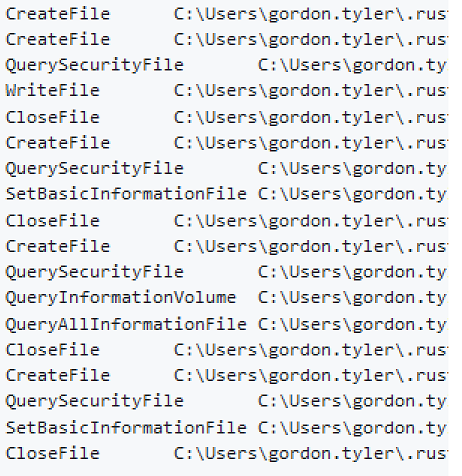
Note:
Remember that very first comment


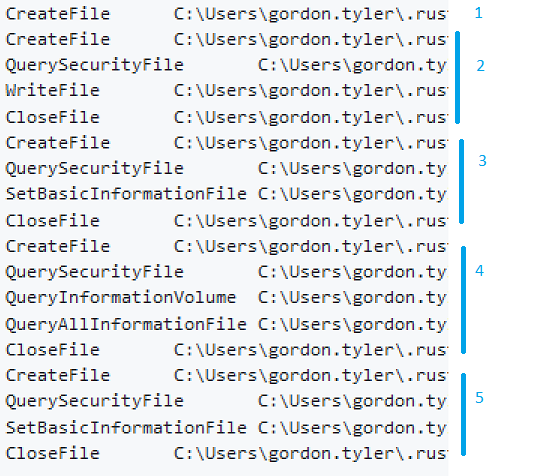
Note:
1. Stat
2. Create, write data
3. set mtime an
4. stat
5. set permissions

And then there is another later walk over the same file.
And a complete copy of everything.


We don't care about mtime. Turning it off saves an open, a read, and write and a
close.
Note: NTFS stores the mtime in the Master File Table - the NTKERNEL could have a
non-file-opening syscall to set file times, but doesn't. Probably
makes the security surface cleaner.
4 kernel mode transitions * 20K = 4 to 6 seconds.
Docs is 20k; src is 7k? toolchain is many fewer files but larger.
Also note that if these lower layers had benchmark suites using e.g. dm-delay,
its likely that the death by a thousand cuts effect would have been mitigated.
One of the things that experienced folk will tend to tell you is that it really
matters what is happening under the hood. And you may be getting sense that that
is involved here.


```
fn chmod(fname: &Path, mode: uint) -> Result<()> {
    let file = open(fname)?
    fchmod(file, mode)?
    close(file)
}
```
Note:
To make it more concrete than me just talking to it, this is what an emulated
chmod inside something like cygwin, or WSL, ends up looking like.


Here I ran off for a bit and worked on tar-rs


* Time of check/Time of use bugs (O_EXCL etc)
* Do the modeset while the file is open fchmod vs chmod.
* Set mtime and atime on file handles
* Optimise out readonly modesetting on Windows

Note: 
All of these things are better for Linux and ext4 as well. But Linux and ext4 is
remarkably tolerant of things being done less than ideally.


v7 - call CloseHandle() from threads 11s
```
    Avoid blocking on CloseHandle

    On Windows closing a file involves CloseHandle, which can be quite
    slow (6+ms) for various reasons, including circumstances outside our
    control such as virus scanners, content indexing, device driver cache
    write-back synchronisation and so forth. Rather than having a super
    long list of all the things users need to do to optimise the performance
    of CloseHandle, use a small threadpool to avoid blocking package
    extraction when closing file handles.

    This does run a risk of resource exhaustion, but as we only have 20k
    files in the largest package today that should not be a problem in
    practice.

    https://www.mercurial-scm.org/pipermail/mercurial-devel/2016-January/078404.html
    provided inspiration for this.

    My benchmark system went from 21/22s to 11s with this change with both
    4 or 8 threads.
```
Note: specifically want to acknowledge the mercurial developers who had
identified that close latency was a performance issue for hg - see the link in
my commit message.
Talk here about the IO completion model - drivers not owning the pages - the app still owns it. Vs Linux where it is moved/transferred into the write cache pathway, and then control returns.


 
Note:
whew. Time for a pause.
We're down to 11s seconds now, is NTFS still in the picture? Is Defender?
Not to mention mcafee/norton/kapersky.


How did just eliminating a directory copy save a whole minute?


Is I/O on NTFS that bad?
Note: mention burning temps on tablet back


rust-docs has ~20k files


each file was being scanned each time it was written
Note:
I don't know about you, but I can't read 20k documents in 11 seconds


Note:
This ruffled some feathers.


 
 
Note:
The discussion with Microsoft staff was excellent.
They asked for traces via the feedback hub.


CloseHandle -> Scan -> Ok/Error
Note:
This is how Defender defaults. And I have traces with the CloseHandle call
taking many 10's of milliseconds. If we dispatch work to defender - to the scan
routine - faster than defender can process it, it backs up.


Open -> Scan -> Ok/Error
Note:
This is what Defender has to do after a reboot.
And it is also an opt-in mode for individual processes at runtime. But not
process controlled.


Defender was updated within a couple of weeks
Note:
to recognise rustup and default to scan-on-first-use rather than scan-on-close for the files that rustup writes.


I suggested a userspace API to let all opensource projects opt-in... but that didn't go anywhere.

Think git/hg/bzr, etc.


v8 - make it slower when it fails
```
    Fix #1870: Race condition with some virus scanners

    Some virus scanners take out handles on files we are going to
    rename, causing access errors and preventing the rename. Typically
    this is short lived. Retry rather than erroring.
```
Note: McAfee


Note:
From the big issue about windows doc installs being slow.
Perhaps it really isn't just windows.
Explain the KB/s install metric.
Also reddit


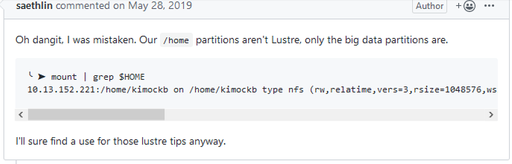
Note:
So this bug was filed about lustre being slow, and turned out to be NFS was
slow.
This leads to


v9 - close() in a thread
Note:
Narrator- this did not solve the problem


## NFS
```
openat(): ~3ms
fchmod(): ~2ms 
write(): ~10ns
close(): ~10ns
chmod(): ~ms
```
Note:
20k items, so 1ms == 20 seconds. so 60 seconds in open(), 40 seconds in fchmod(), and 20 seconds() in the final chmods.=120s
So, the things we need to do to make it fast for NFS filesystems are:
* don't block on inode creation
* don't apply chmod's twice
* and do the final chmod threaded or in the initial IO


v10 - thread all *file* IO
Note:
A version of this logic is included in rust 1.37 so that rust-doc (and cargo doc
etc) generate documentation in a threaded fashion, for exactly the same reason. win-api for instance really benefits.


v11 - thread directory operations as well
Note:
This required cross-thread coordination because directories are effectively
global state


v12 - set permissions during extraction
Note: because duh. Otherwise we just blow the disk cache.


I also added a tracing system in there that outputs Catapult trace files - thats
the Chromium in-browser profiler.


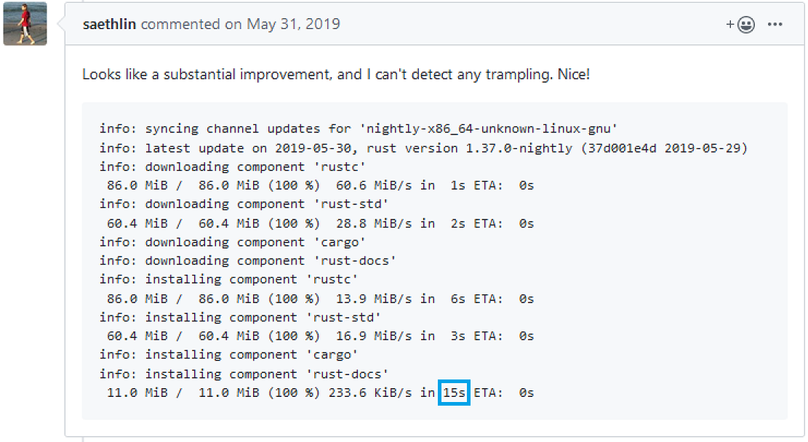


Syscalls are not free


Not on Linux


Not on Windows


Don't blame your serial code's serial performance on NTFS


Antivirus will make anything appear worse


Even when it is not the root of the problem


But wait, what about WSLv1


It should be fast now...


Oh Defender
Note:
Hello? Microsoft? Here's another trace. Yes, yes really. Thanks.


Yet with Defender disabled it is still slow.


 In `openat()`.


Huh
Note: This is slow the way CloseHandle was slow before


https://github.com/microsoft/WSL/issues/873
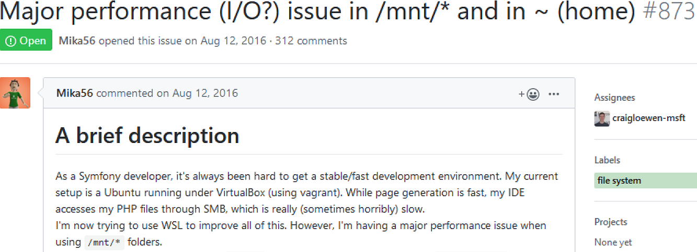
Note:
This is another bug where a lot of analysis that hasn't actually been terribly
rigorous has gone on. The platform - Windows includes tools that allow deep
inspection of behaviour without dissassembly (since thats against the EULA :{) -
and one can gain a good understanding about what is occuring without simply
throwing existing use cases up against the wall and seeing what sticks.


 
Note:
Nearly twenty years ago, before VMs. When you wanted a Linux environment but
still had to work in corporate environments, there was another option.


(tm)(Public Domain) https://commons.wikimedia.org/wiki/File:Cygwin_logo.svg
Note:
To work on Squid, back before I worked for Canonical, I started using, then contributing to,
and eventually became a core developer on the Cygwin project (just from the community side
,not a RedHat staff member). WSL is extremly familiar territory to me - emulate a POSIX
syscall layer on top of Windows. WSL's mandate is a bit more specific than Cygwin's was: it has to
pretend to be Linux itself, with complete compatibility, whereas we had a custom
libc - newlib - that allowed us to aim for source compatibility rather than
binary compatibility. Anyhow. Familiar territory. Hi Chris, Corwinna.


strace analysis https://github.com/rust-lang/rustup/issues/1866
```
Here three threads are involved:
at 8:11.499554 16107 starts a close() on fd 8;
at 8:11.501767 15873 starts openat()
at 8:11.502523 15873 completes openat's CreateFile on the NTFS side
at 8:11.505732 16103 starts a close() on fd 7
at 8:11.512515 16107 completes it's close() on fd 8
at 8:11.513212 15873 completes it's openat and gets fd 8 - the one just closed.
```
Note:
Sure looks like a coarse lock on the fd<->Handle table to me, but of course, I don't have the WSL source code.
Lets check what that close(8) was for and look at its procmon close data.


```
15873 20:11:46.474059 openat(AT_FDCWD, "...fn.cttz.html", O_WRONLY|O_CREAT|O_EXCL|O_CLOEXEC, 0666 <unfinished ...>
15873 20:11:46.476027 <... openat resumed> ) = 8 <0.001350>
```

```
8:11:46.4994827 PM	0.0122879	rustup	21796	30740	CloseFile	
8:11:46.5005271 PM	0.0000078	MsMpEng.exe	6212	9004	CreateFileMapping	
8:11:46.5005548 PM	0.0000043	MsMpEng.exe	6212	9004	QueryStandardInformationFile	
```
Note:
In the top we see a strace showing that the fd 8 was for another output file
that would have been virus scanned by Defender, explaining a slow close.
At .4994827 close is started and takes 0122879 finishing at .5117706. At 5005271
Defender starts operating on the file. So this lines up very well: defender
mmaps the file when close is called, blocks the close, and WSL has a coarse lock
on the FD table. And yes, strace appears to have very slight clock skew vs
procmon here, which makes any analysis depending on strict timestamp comparisons
across tools suspect. Fortunately we don't do that...


No response at this point from MS :/
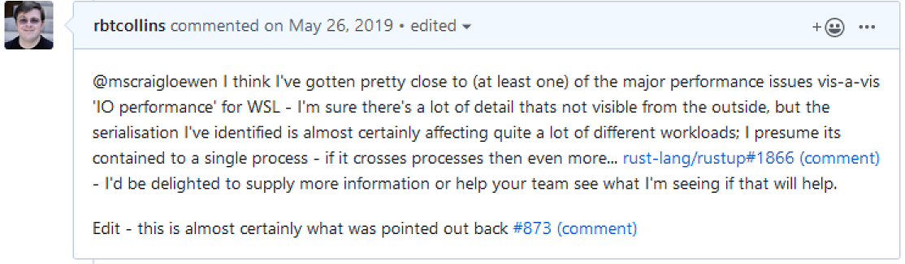
Note: But it is again not NTFS IO performance that is causing the problem. 


These slides: 
https://github.com/rbtcollins/reveal.js/tree/master/lca-ntfs-2020.html

* Robert Collins
* @rbtcollins (twitter, linkedin)
* robertc@robertcollins.net


# vim: sts=2 sw=2 et
