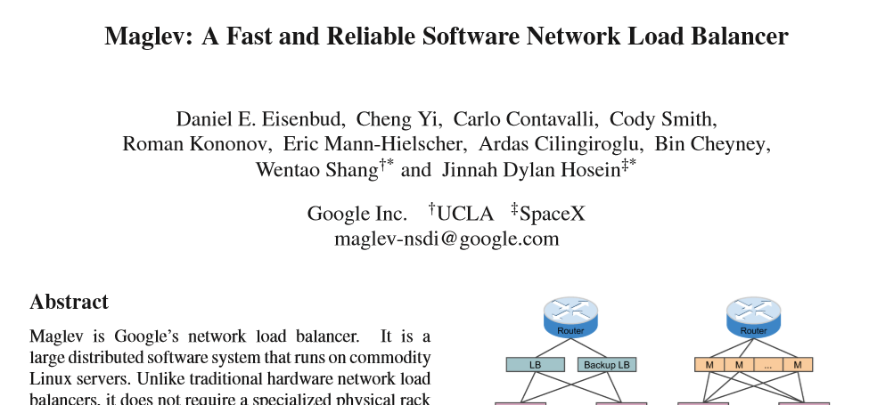

## (re)implementing (Google) maglev in Rust

Slides at https://github.com/rbtcollins/reveal.js

<small>Robert Collins

robertc@robertcollins.net

@rbtcollins (Twitter)

SRE architect @ VMware</small>


## Protocol

* Questions at anytime are fine.
  * During the talk just raise a hand.
  * Don't wait for the mic: I'll repeat questions


## Sometime in 2016


Google release a paper:


Note:
This is interesting because it gives insight into what very large sites
are doing. Any you have to wonder - why didn't they just use some existing LB
software? We've got LVS right? Or Squid/Varnish/HAProxy ?


Its picked up by news sites


Who then go off the rails


I had a month of time to myself as I moved jobs.

Note:
Mow the lawns?
Fix the pile of broken toys?
Do some 3D widgets to hot-fix badly designed appliances?
No... I decided to implement Maglev


1. Rust is fantastic for systems programming.
2. Use libpnet if you are writing packet manipulation code. Really.  <!-- .element: class="fragment" -->
3. Networking has a deep dependency stack <!-- .element: class="fragment" -->
4. There are often better ways to do things than you know. <!-- .element: class="fragment" -->
5. Modern CPUs can really do a lot of work. <!-- .element: class="fragment" -->
6. We should probably teach LVS the innovative bits of Maglev. <!-- .element: class="fragment" --> 
Note:
But allow time to learn: borrow checker, how to do unit tests in rust - how to
make things pluggable in tasteful ways to permit mocking. How to work with cargo
and multiple version resolution. The community of add-ons is awesome.


## LVS

```
+------------------------------------+
| Client | Router |  LVS   | Service |
+------------------------------------+
|    +--SYN-->    |        |         |
|        |   +--SYN-->     |         |
|        |        |  +SYN(IPIP)>     |
|     <---------SYN-ACK---------+    |
|   +-ACKDATA->   |        |         |
|        | +--ACKDATA-->   |         |
|        |       |  +ACKDATA(IPIP)>  |
|     <------ACKDATA------------+    |
|        |        |        |         |
```


## Maglev

```
+------------------------------------+
| Client | Router | Maglev | Service |
+------------------------------------+
|    +--SYN-->    |        |         |
|        |    +SYN(GRE)>   |         |
|        |        |   +SYN(GRE)>     |
|     <---------SYN-ACK---------+    |
|   +-ACKDATA->   |        |         |
|        |  +ACKDATA(GRE)> |         |
|        |        |  +ACKDATA(GRE)>  |
|     <------ACKDATA------------+    |
|        |        |        |         |
```
Note:
This means that maglev doesn't need to change the size of the packet.
Also means that maglevs don't need to be on the same segment as the router
doing the division of traffic.(which is really important)


## Router/network integration (LVS)

* Mirroring LAN support (for Saru)
* LVS director performs encapsulation


## Router/network integration (Maglev)

* Router needs to encapsulate traffic in GRE
* Router should be consistent about the maglev node it sends traffic to in the
  absence of reconfiguration - consistent ECMP
* In rusty rail I plan to make this pluggable <!-- .element: class="fragment" -->


## Backend selection (LVS)

* Kernel LVS tables are modified by an external process (ldirectord)
* Runs on the same machine as LVS itself
* Pluggable round robin through source or destination hashing
* backend presumed to be healthy


## Backend selection (Maglev)

* 5-tuple (srcip srcpt destip destpt protocol) consistent hash
  * Tuned consistent hash which is extremely even in distribution
* after selection cached in a connection cache
* backend presumed to be healthy
* exterior process (e.g. borg) determining health and updating nodes
* I don't plan to make this pluggable <!-- .element: class="fragment" -->


## Active-active properties (LVS)

* Arbitrary number of nodes
* All nodes receive all traffic
* Nodes discard based on saru setting up drop filters for packets
* Saru requires director <-> director traffic
* Connection synchd requires director <-> director traffic
* Peak scale = line rate for your network


## Active-active properties (Maglev)

* Arbitrary number of nodes
* Each node receives 1 / Nth of traffic
* Peak scale = N * line rate for your network
Note:
  Critical for scaling bisection bandwidth


## Fragments

* LVS has no special handling of fragments: connection syncing + connection
  tracking is sufficient
* Maglev sends all fragments on a connection to one maglev to handle
Note:
uses a 3-tuple (srcip, destip, protocol) consistent hashing to forward
fragments to a single maglev which then uses its connection tracking table to
fast-path the non-first fragments once the first fragment has been seen (which
can be handled via 5-tuple lookup)


## Availability

* Maglev can trombone services to a different maglev instance when the local
  backends are all dead


## Unique aspects of Maglev

* Linear addition of nodes
* Scale to arbitrary bandwidth within your clusters
* Dynamically forward traffic to remote clusters when local services are dead
  * Note that no global propogation of state is required
* No inter-node synchronisation traffic - just deterministic behaviour


## What could be better?

* Less dependence on router capabilities
* Less dependence on high privilege access to the machine its running on
Note:
So you could deploy in AWS or other clouds without ECMP GRE encapsulating
ingress. AWS with anycast is possible, or direct connect - so hmmm....  eBPF /
XDP / TC offers a significant opportunity there - but the state management may
not be mature enough yet. Open question


## Could you do the same thing differently with similar perf?


TC + XDP + P4 + eBPF
Note:
run the forwarding logic in a kernel JIT and possibly even on the NIC
itself, pass connection info and stats back up out of those layers for userspace
(or even kernel in the NIC -> eBPF case) tracking of the relevant state, pass a
kernel map down into the card for the lookup table. More mature than it was but
still very much expect to be fixing the layers as you go I suspect.


* Userspace control layer
* Kernel eBPF layer updated when backends change
* Kernel eBPF layer tracking connstats internally


## So I'm going to implement this thing in ~30 days

* What should I write it in?
* Should I clone closely - userspace networking and all?
* Is someone already doing this?
* What userspace networking bits should I use?


## What resources do I have?

* Some time
* A linux server w/no ring-exposing cards
* An AWS account (but VMs?!)
* A Windows laptop w/Linux in a Hyper-V VM


## Good luck, bye!


* Rust, a language I like but have no depth of experience in
  * golangs abstraction of concurrency makes thread-affinity-steering harder...
* Aim to clone it all eventually
* Noone seems to be implementing it
* Lets develop on Hyper-V


## Userspace networking


Note:
Innovation tokens represent things you are taking risks on.


# DPDK
Note:
It wants to own *everything*. Not enough innovation tokens to consider gluing
it to rust


# SR-IOV
Note:
if DPDK was a token too far, this is way over the top. Userspace PCI
device use? Also, is there even a hyper-v emulated SR-IOV layer? Or does my MS
Surface have an SR-IOV enabled wifi? Brain breaks. unikernals perhaps?


# Netmap

1. Folk claim to be doing 70Mpps using netmap + dual-port 40Gbps cards
2. Linux and nascent Windows support as well as the native FreeBSD
3. Supports emulating network rings for adapters that don't have them
Note: Chelsio are the vendor claiming that...


# Perfect: I'm sold


# Lets talk about netmap


```$ sudo ./pkt-gen -i eth0 -f ping```


https://github.com/luigirizzo/netmap/issues/177
```
[  185.313723] netmap: module verification failed: signature and/or required key missing - tainting kernel
[  185.315484] 750.467721 [3255] netmap_init               run mknod /dev/netmap c 10 53 # error 0
[  185.315843] netmap: loaded module
[  207.096641] 772.249375 [2013] netmap_do_regif           lut ffffc90001017000 bufs 163840 size 2048
[  207.097373] 772.250103 [ 379] generic_netmap_register   Generic adapter ffff8801f6e3f000 goes on
[  207.098044] 772.250773 [ 430] generic_netmap_register   RX ring 0 of generic adapter ffff8801f6e3f000 goes on
[  207.098697] 772.251423 [ 440] generic_netmap_register   TX ring 0 of generic adapter ffff8801f6e3f000 goes on
[  207.101306] 772.254038 [ 455] generic_qdisc_init        Qdisc #0 initialized with max_len = 1024
[  209.107563] ------------[ cut here ]------------
[  209.108869] kernel BUG at /build/linux-FvcHlK/linux-4.4.0/net/core/skbuff.c:1201!
...
[  209.109024] Call Trace:
[  209.109024]  [<ffffffffc00793e0>] netvsc_start_xmit+0x560/0x950 [hv_netvsc]
```


```
static int netvsc_start_xmit(struct sk_buff *skb, struct net_device *net)
...
ret = skb_cow_head(skb, RNDIS_AND_PPI_SIZE);
```
which leads to
```
return pskb_expand_head(skb, ALIGN(delta, NET_SKB_PAD), 0, GFP_ATOMIC);
```
and thus to 
```
BUG_ON(skb_shared(skb));
```
Note: pkt_gen holds a refcount of 2 when sending a packet so it can reuse the
same packet buffer over and over.


# in-tree pkt-gen works?!


```netdevice.h:
@needed_headroom: Extra headroom the hardware may need, but not in all 
                  cases can this be guaranteed
```
Note: so - hyperv wants some headroom, in-tree pkt-gen gives it, ...


```
nm_os_generic_xmit_frame(struct nm_os_gen_arg *a)
{
        struct mbuf *m = a->m;
        u_int len = a->len;
        netdev_tx_t ret;

        /* Empty the mbuf. */
        if (unlikely(skb_headroom(m)))
            skb_push(m, skb_headroom(m));
```
Note: Whats missing here? Preserving headroom. I put a patch together and it
worked. I also reached out to folk I knew from OpenStack who were
involved with HyperV and got asked to file a bug...


https://bugzilla.kernel.org/show_bug.cgi?id=118771


```
This was triggered via netmap (which is about to have a workaround added to it)
which was transmitting a shared skb without enough headroom. skb_cow_head()
will call into pskb_expand_headroom if it needs to expand headroom, but when
the reference count is not 1, pskb_expand_headroom panics.

I'm not sure whether a) skb_cow_head is wrong (and it should copy the skb in
this situation) or b) whether hv_netvsc should not be using skb_cow_head here.
```


# 2 days later


Netmap's bug is closed with a fix merged to master.


# 8 months later


```
Bug is invalid.

Kernel bugzilla is only for upstream kernel bugs WITH NO OUT OF TREE drivers.
```


## Ok so now I can use netmap on my VM? From rust?


# Somewhat


```
[505160.092132] BUG: unable to handle kernel NULL pointer dereference at 0000000000000798
...
```
https://github.com/luigirizzo/netmap/issues/189


```
$ pkt-gen -i eth0^ -f ping -n 2
```
Note:
eventually tracked down to a bug that hadn't shown up in three years of
use. Yay me :)


# Works now right?


```
$ sudo ethtool -K eth0 tx off rx off gro off tso off gso off
```
Note:
Offloading doesn't happen to packets handled by netmap.


# Lets talk about Rust


* Systems language
* Super safe
* Things are only dynamic where you the user make them so
Note:
there is lots of stuff that could be said, I'm only talking about the bits relevant to this talk ;)
Every type is fully defined at link time; there's no such thing as assigning a
new method descriptor at runtime and using it. There is runtime dispatch -
'trait objects'. Very fast - use the stack entirely and the heap as needed.


```
pub fn permute_backend(name: &str, pool_size: u32) -> Vec<u32> {
    // May be faster to generate just-in-time as an iterator: profile eventually.
    let mut s = SipHasher::new();
    name.hash(&mut s);
    let offset = (s.finish() % pool_size as u64) as u32;
    "differenthash".hash(&mut s);
    let skip = (s.finish() % (pool_size as u64 - 1) + 1) as u32;
    permutations(offset, skip, pool_size)
}
```


```
pub fn permutations(offset: u32, skip: u32, pool_size: u32) -> Vec<u32> {
    let mut res: Vec<u32> = Vec::with_capacity(pool_size as usize);
    for pos in 0..pool_size {
        res.push((offset + pos * skip) % pool_size)
    }
    res
}
```


```
pub fn populate(&mut self) {
    // This is 'approximately' 100x the number of backends; could look for the next higher
    // prime in future to ensure that.
    let lookup_size = self.backends.iter().filter(|b| b.live).count() * 100;
    let p = primes::primes(lookup_size);
    let lookup_size = p[p.len() - 1] as u32;
    for backend in &mut self.backends {
        if backend.permutation.len() != lookup_size as usize {
            backend.permutation = permute_backend(&backend.name, lookup_size)
        }
    }
    let mut next = vec![0; self.backends.len()];
    self.lookup = vec![u32::max_value();lookup_size as usize];
    let mut allocated = 0;
    loop {
        for (i, backend) in self.backends.iter().enumerate() {
            if !backend.live {
                continue;
            }
            let mut candidate = backend.permutation[next[i]];
            while self.lookup[candidate as usize] != u32::max_value() {
                // Find next unallocated position from backend.
                next[i] += 1;
                candidate = backend.permutation[next[i]];
            }
            self.lookup[candidate as usize] = i as u32;
            next[i] += 1;
            allocated += 1;
            if allocated == lookup_size {
                return;
            }
        }
    }
}
```
Note:
siphasher removed from stdlib - its not always easy :)


# But also


```
fn examine_one<'a>(rx_slot_buf: RxSlotBuf, routes:&ConsistentHash) -> Result<Direction, error::BrokenRail> {
    let packet = match EthernetPacket::new(rx_slot_buf.1) {
        Some(packet) => packet,
        None => return Err(error::BrokenRail::BadPacket),
    };
    match packet.get_ethertype() {
        Ipv4 => {
            if let Some(ip) = Ipv4Packet::new(packet.payload()) {
                match ip.get_next_level_protocol() {
                    Gre => {
                        if let Some(gre) = gre::GrePacket::new(ip.payload()) {
                            match gre.get_protocol_type() {
                                0x0800 => {
                                    if let Some(inner_ip) = Ipv4Packet::new(gre.payload()) {
                                        let hash = hash_ipv4_packet(&inner_ip);
                                        let target_ipv4 = select_destination(routes, &inner_ip);
                                        println!("Inner IP {:?} {:?} {:?} {:?}",
                                                 inner_ip.get_source(),
                                                 inner_ip.get_destination(),
                                                 hash, target_ipv4);
                                        return Ok(Direction::Wire(target_ipv4));
                                    }
                                    // try!(move_packet(rx_slot_buf, tx_slot_buf));
                                    // if we can't handle the packet, drop it.
                                    return Ok(Direction::Drop);
                                }
                                // Drop all other gre packets as noise
                                _ => return Ok(Direction::Drop),
                            }

                        } else {
                            println!("Failed to process GRE packet");
                            // in future perhaps forward to host?
                            return Ok(Direction::Drop);
                        }
                    }
                    // Forward non-GRE
                    _ => return Ok(Direction::Destination),
                    // try!(move_packet(rx_slot_buf, tx_slot_buf)),
                }
            } else {
                return Err(error::BrokenRail::BadPacket);
            };
            // println!("packet {:?}", packet.get_ethertype())
        }
        // Forward non-IPV4 packets - ARP etc
        _ => return Ok(Direction::Destination),
        // try!(move_packet(rx_slot_buf, tx_slot_buf)),
    }
}
```


# libpnet


* Rust bindings to networking
* Packet description and manipulation
* Leans heavily on `syntex_syntax`
  * which has been abandoned <!-- .element: class="fragment" -->


* Also different network send/recv layers
  * included netmap
  * Structurally unable to do zero-copy IO <!-- .element: class="fragment" -->
Note:
So you should it, but also, you shouldn't.


```
/// Represents a TCP Packet
#[packet]
pub struct Tcp {
    pub source: u16be,
    pub destination: u16be,
    pub sequence: u32be,
    pub acknowledgement: u32be,
    pub data_offset: u4,
    pub reserved: u3,
    pub flags: u9be,
    pub window: u16be,
    pub checksum: u16be,
    pub urgent_ptr: u16be,
    #[length_fn = "tcp_options_length"]
    pub options: Vec<TcpOption>,
    #[payload]
    pub payload: Vec<u8>,
}
```
Note:
in particular note the u4, u3, u9be types.


## GRE wasn't supported

```
commit c868cb0a158e7301b5ef546f0123945913de56d4
Author: Robert Collins <robertc@robertcollins.net>
Date:   Sun Jun 12 16:48:08 2016 +1200

    Basic implementation of GRE packets.

    Its a little complex due to the optional fields.

 build.rs             |   1 +
 src/packet/gre.rs    |  17 +++++++++++++++++
 src/packet/gre.rs.in | 154 ++++++++++++++++++++++++++++++++++++++++++++++++++++++++++++++++++++++++++++++++++++++++++++++++++++++++++++++++++++++++++++++++++++++++++++++++++++++++++
 src/packet/mod.rs    |   1 +
 4 files changed, 173 insertions(+)
```


## progress

* Could preserve the host's network and share the NIC
* Could drop or forward or redirect *by MAC*


# What about by IP address?


# The paper did not discuss this


* Write own implementation of ARP?
  * what about IPv6 <!-- .element: class="fragment" -->
* Use the kernels <!-- .element: class="fragment" -->
  * netlink <!-- .element: class="fragment" -->


# pnetlink

* https://github.com/polachok/pnetlink
* pnet based bindings to netlink
* Pretty straight forward to work with.
* Bit of reading an trawling through (linux) source to understand


Did you know netlink is host-endian?


https://github.com/polachok/pnetlink/issues/5


```
#[cfg(target_endian = "little")]
type u32ne = u32le;
#[cfg(target_endian = "big")]
type u32ne = u32be;
```
Note:
because the lovely language for describing packets assumed endianness was
going to be a thing


```
pub fn lookup<'a>(&'a mut self, addr: &Ipv4Addr) -> Option<MacAddr> {
    if let Some(result) = self.entries.get(addr).map(|e| e.mac) {
        return Some(result);
    } else {
        let entries = &mut self.entries;
        let neighbours =
            self.netlink.iter_neighbours(Some(&self.link)).unwrap().collect::<Vec<_>>();
        for neighbour in neighbours {
            if let Some(mac) = neighbour.get_ll_addr() {
                if let Some(IpAddr::V4(ipaddr)) = neighbour.get_destination() {
                    entries.insert(ipaddr,
                                   CacheEntry {
                                       mac: mac,
                                       expires: SystemTime::now() + Duration::new(30, 0),
                                   });
                }
            }
        }
        match entries.get(addr).map(|e| e.mac) {
            Some(result) => Some(result),
            None => {
                // TODO: trigger a lookup by emitting a packet to the
                //       destination address before returning None
                None
            }
        }
    }
}
```
Note:
maybe mention the struct you cannot find anymore that is aliased in all
      the code out there... wrongly.


# More progress

* Could preserve the host's network and share the NIC
* intercepts GRE traffic and applies the maglev hash lookup
* handles arbitrary number of clients and servers
* only one virtual service supported presently
* no stats or metrics
* no runtime configuration API


# Testing

* Used FreeBSD VMs for very small footprint w/ customisable GRE handling
* Wrote a salt module to let me use salt to configure networking on clients and
  servers
* Hoping to do some real world testing (but dedicated time on 10Gbps+ servers
  is not trivially doable)


# Should you use it?


# Improving LVS

* XDP + eBPF + P4 to push packet handling down to the NIC / avoid most kernel
  overheads
* Change from saru and mirroring to ECMP in the router(s)
* Add fragment handling
* Add 5-tuple hashing


## Credits / References / Questions

* https://research.google.com/pubs/pub44824.html
* https://p4.org
* https://www.iovisor.org
* https://github.com/luigirizzo/netmap
* https://research.google.com/pubs/pub44824.html
* https://giphy.com/gifs/i-had-to-okay-love-this-photoshoot-so-much-sgfauo9CqBcAw/
* https://giphy.com/gifs/development-labs-keynote-ARb77MvJVd7Uc
* http://mcfunley.com/choose-boring-technology
* https://github.com/libpnet/libpnet
* https://github.com/serde-rs/syntex/issues/114
* https://giphy.com/gifs/scared-no-nope-6h4z4b3v6XWxO

These slides: 
https://github.com/rbtcollins/reveal.js/tree/master/lca-rustyrail-2018/

* Robert Collins
* @rbtcollins
* lifeless on freenode
* robertc@robertcollins.net


# vim: sts=2 sw=2 et
