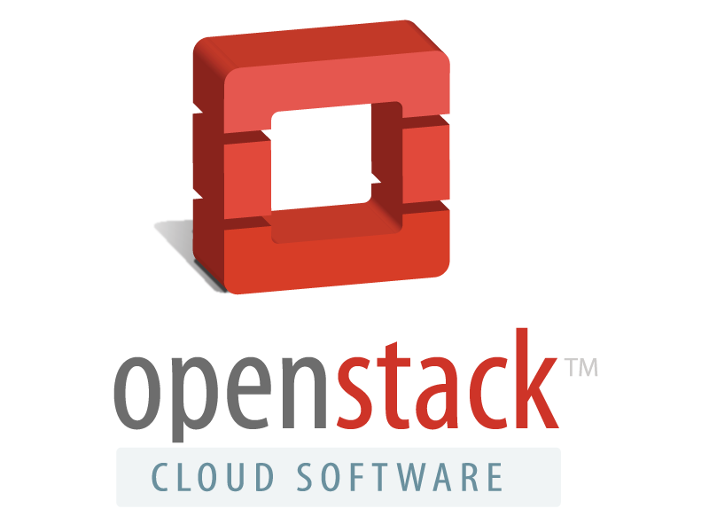

## Welcome

* Robert Collins  @rbtcollins (Twitter)
* Joshua Hesketh  

## PyCon AU

https://2015.pycon-au.org/

## **OpenStack** Miniconf

## Sponsors

## OpenStack Foundation

### Miniconf

https://www.openstack.org/foundation

## HP

### morning / afternoon tea

http://www.hp.com/

## Code of Conduct

Linked from PyCon AU FAQ

<small>https://github.com/linuxaustralia/constitution_and_policies/blob/master/code_of_conduct.md</small>

## Schedule

On the PyCon AU website

## OpenStack

### A vision for the future

Monty Taylor
Note:
Foundation board member, TC member, HP DT
